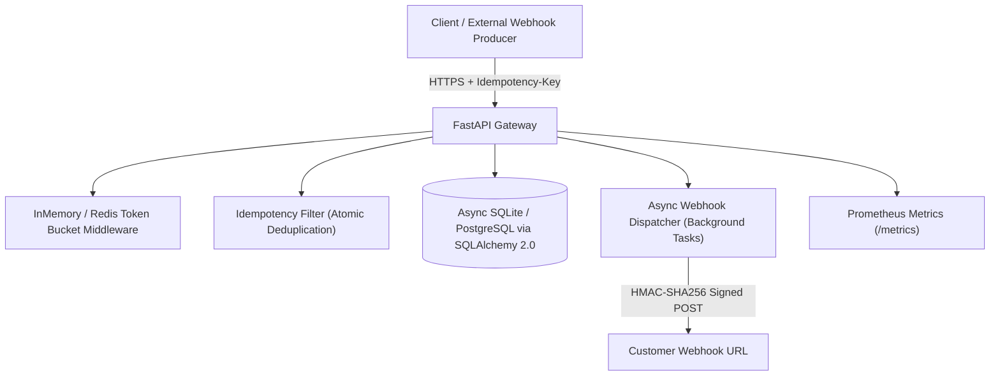

# PulseStream ⚡
### High-Throughput Distributed Event Ingestion & Webhook Dispatcher Engine

PulseStream is a production-grade backend service built in **Python & FastAPI** for high-throughput event ingestion, atomic rate limiting, secure webhook dispatch, and real-time observability.

---

## 🛠 Tech Stack
| Layer | Technology |
| :--- | :--- |
| **Runtime & Framework** | Python 3.12, FastAPI, Uvicorn |
| **Rate Limiting** | Redis Lua Scripts (Atomic Token Bucket via `EVALSHA`) |
| **Database** | PostgreSQL (Async via SQLAlchemy 2.0 + `asyncpg`) |
| **Migrations** | Alembic |
| **Auth** | API Key Authentication (SHA-256 hashed storage) |
| **Webhook Security** | HMAC-SHA256 Payload Signing |
| **Infrastructure** | Docker, Docker Compose |
| **Testing** | PyTest (fixtures, mocking, parametrization) |
| **CI/CD** | GitHub Actions |

---

## 🏛️ System Architecture



---

## 🌟 Key Engineering Highlights
- **Atomic Idempotency**: Guarantees zero duplicate side-effects on network retries via `Idempotency-Key` headers.
- **Distributed Token-Bucket Rate Limiter**: Protects downstream APIs from burst spikes with automatic `X-RateLimit-*` headers.
- **HMAC-SHA256 Payload Signing**: Secures outgoing webhook deliveries against tampering using cryptographic signatures (`X-PulseStream-Signature`).
- **Async SQLAlchemy 2.0 ORM**: Fully non-blocking database queries with async connection pooling.
- **Observability**: Prometheus metrics exposition (`/metrics`), `/healthz`, and `/readyz` health endpoints.

---

## 🚀 Quickstart

### 1. Run with Docker Compose
```bash
docker-compose up --build
```
Open interactive Swagger UI: `http://localhost:8000/docs`

### 2. Run Locally with Virtualenv
```bash
pip install -r requirements.txt
uvicorn app.main:app --reload --port 8000
```

### 3. Run Automated Tests
```bash
pytest --verbose
```
