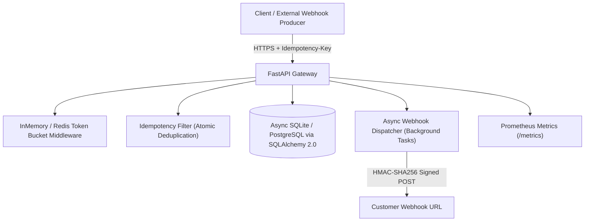

# PulseStream ⚡
### High-Throughput Distributed Event Ingestion & Webhook Dispatcher Engine

PulseStream is a production-grade backend service built in **Python & FastAPI** showcasing modern API design, asynchronous execution, distributed idempotency, rate limiting, and observability.

---

## 📋 Comprehensive Engineering Planning Hub
For the full end-to-end Product Requirement Document (PRD), system design blueprints, 4-week implementation sprints, and resume articulation guide, see the [**`plan/` Hub**](./plan/README.md).
- 📑 [**`01_requirements_and_prd.md`**](./plan/01_requirements_and_prd.md): Functional/Non-Functional requirements, user stories, and SLO targets.
- 🏛️ [**`02_system_design_architecture.md`**](./plan/02_system_design_architecture.md): Redis Lua token-bucket algorithm, Transactional Outbox pattern, and state machines.
- 🚀 [**`03_sprint_milestones_and_tasks.md`**](./plan/03_sprint_milestones_and_tasks.md): 4-week step-by-step developer implementation tasks.
- 🏆 [**`04_quality_testing_and_expectations.md`**](./plan/04_quality_testing_and_expectations.md): Definition of Done, load test benchmarks, and interview STAR answers.

---

## 🏛️ System Architecture



---

## 🌟 Key Engineering Highlights
- **Atomic Idempotency**: Guarantees zero duplicate side-effects on network retries via `Idempotency-Key` headers.
- **Distributed Token-Bucket Rate Limiter**: Protects downstream APIs from burst spikes with automatic `X-RateLimit-*` headers.
- **HMAC-SHA256 Payload Signing**: Secures outgoing webhook deliveries against tampering using cryptographic signatures (`X-PulseStream-Signature`).
- **Async SQLAlchemy 2.0 ORM**: Fully non-blocking database queries with async connection pooling.
- **Observability**: Prometheus metrics exposition (`/metrics`), `/healthz`, and `/readyz` health endpoints.

---

## 🚀 Quickstart

### 1. Run with Docker Compose
```bash
docker-compose up --build
```
Open interactive Swagger UI: `http://localhost:8000/docs`

### 2. Run Locally with Virtualenv
```bash
pip install -r requirements.txt
uvicorn app.main:app --reload --port 8000
```

### 3. Run Automated Tests
```bash
pytest --verbose
```
