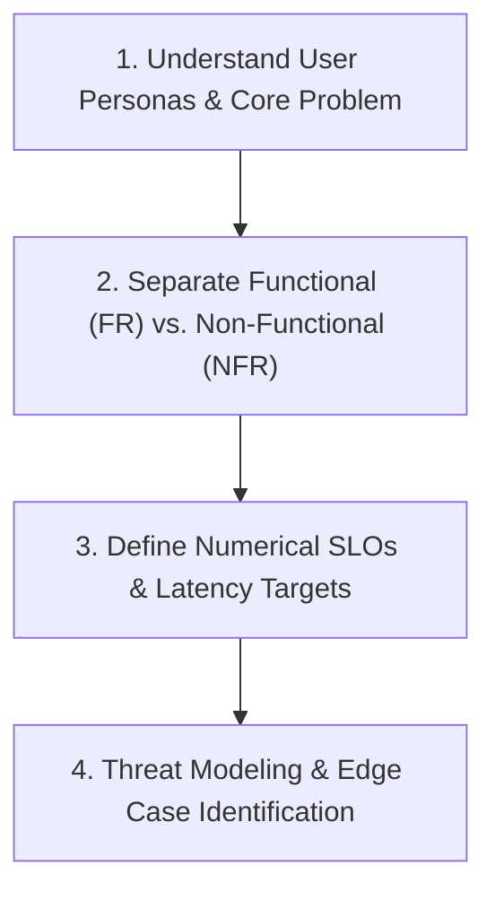

# Product Requirement Document (PRD) & Requirements Discovery 📋
### PulseStream: Distributed Event Ingestion & Webhook Dispatching Engine

---

## 🧭 1. The Senior Engineer Requirements Discovery Framework

When building any backend system or taking system design interviews, never start coding immediately. Follow this **4-step requirements discovery framework**:

---

## 🎯 2. Product Context & Problem Statement

### The Problem
Modern distributed applications (e.g. Stripe, Shopify, GitHub) generate millions of asynchronous events (payments completed, invoices generated, orders shipped). 
Third-party customer servers are often slow, crash unpredictably, or fail to respond. 
- If the sender sends synchronously, customer downtime will block or crash the sender's servers.
- If network requests time out and the sender retries, customers may get charged twice or process duplicate orders.

### The Solution: PulseStream
PulseStream acts as a **bulletproof, high-throughput buffer**:
1. Ingests events asynchronously at microsecond speed with atomic **Idempotency** (zero duplicate processing).
2. Protects downstream systems using **Distributed Token-Bucket Rate Limiting**.
3. Dispatches webhooks to customer endpoints with **HMAC-SHA256 signatures**, **exponential backoff retries**, and a **Dead Letter Queue (DLQ)** for unrecoverable failures.

---

## 📋 3. Functional Requirements (FRs) — *What the System MUST Do*

- **FR-1: High-Throughput Event Ingestion (`POST /api/v1/events`)**:
  - Ingest JSON events with a tenant identifier, event type, and arbitrary JSON payload.
  - Return HTTP `201 Created` immediately with an assigned unique event ID (`evt_xxxx`).
- **FR-2: Atomic Idempotency (`Idempotency-Key` Header)**:
  - If a client retries a request with the same `Idempotency-Key` within a 24-hour window, the API must return the cached original response without creating duplicate database records or re-triggering webhook dispatches.
- **FR-3: Webhook Endpoint Management (`POST /api/v1/webhooks`)**:
  - Allow tenants to register target URLs and optional signing secrets.
- **FR-4: Asynchronous Reliable Dispatching**:
  - Whenever an event is ingested, dispatch a `POST` request to all active webhook endpoints subscribed to that tenant.
  - Sign the payload using `HMAC-SHA256` in the header: `X-PulseStream-Signature: sha256=<hash>`.
- **FR-5: Exponential Backoff & Dead Letter Queue (DLQ)**:
  - If a customer endpoint returns `5xx` or times out, retry up to 5 times with exponential backoff and randomized jitter.
  - If all 5 attempts fail, move the payload to a persistent **Dead Letter Queue (DLQ)**.
- **FR-6: Observability & Health Probing**:
  - Expose `/healthz` (liveness), `/readyz` (readiness), and `/metrics` (Prometheus exposition).

---

## ⚡ 4. Non-Functional Requirements (NFRs) & Service Level Objectives (SLOs)

| NFR Dimension | Engineering Requirement | Target Metric (SLO) |
| :--- | :--- | :--- |
| **Ingestion Latency** | Ingestion must be non-blocking in memory/fast disk. | **p95 < 10ms, p99 < 25ms** |
| **Ingestion Throughput** | Must handle sustained burst traffic on single node. | **$1{,}500+\text{ req/sec}$** |
| **Delivery Reliability** | Zero event loss across server crashes or database restarts. | **At-Least-Once Delivery ($100\%$)** |
| **Rate Limiting** | Prevent noisy neighbors from exhausting system resources. | **Configurable per tenant (e.g. 60–120 req/min)** |
| **Security & Integrity** | Tamper-proof payload verification. | **HMAC-SHA256 signed headers** |

---

## 🛡️ 5. Threat Modeling & Edge Cases to Handle

1. **The Double-Click / Network Timeout Retry**:
   - *Scenario*: Client sends `POST /events`, payment processes, but client's Wi-Fi drops before receiving the HTTP 201 response. Client retries 2 seconds later.
   - *Requirement*: `Idempotency-Key` check must atomically recognize the in-flight/completed key and return the original receipt without double-charging.
2. **Customer Endpoint Outage (The Thundering Herd)**:
   - *Scenario*: A major customer endpoint goes down for 30 minutes. Thousands of webhooks fail simultaneously.
   - *Requirement*: Exponential backoff with **jitter** must be used to avoid all retry requests hitting the customer simultaneously the exact second they reboot.
3. **Server Process Crash (The Volatile Memory Trap)**:
   - *Scenario*: The API server receives an event, acknowledges HTTP 201, and power drops before the background task executes.
   - *Requirement*: Transactional Outbox pattern in PostgreSQL guarantees the event and its dispatch intent are committed to disk before acknowledging the client.
