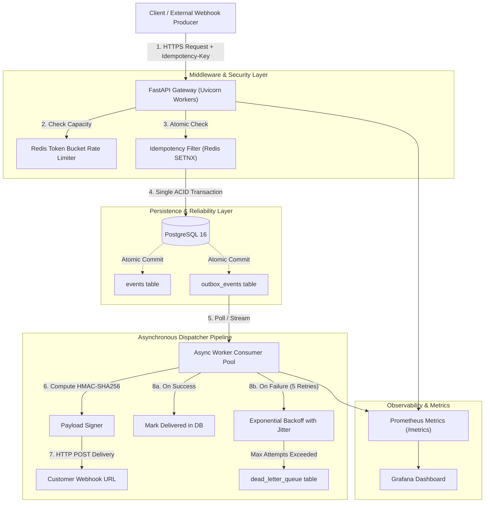
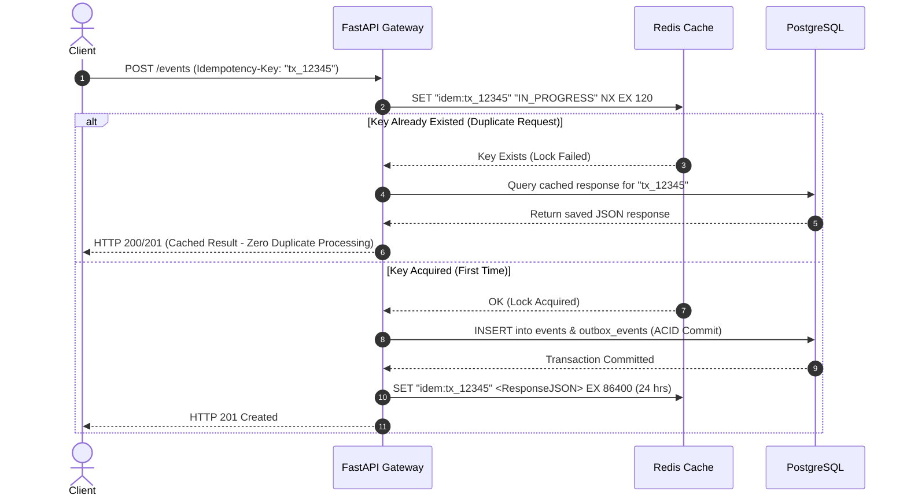

# System Design & Technical Architecture Blueprint 🏛️
### PulseStream: Distributed Ingestion, Idempotency & Webhook Dispatching

---

## 🗺️ 1. End-to-End System Architecture



---

## 🔒 2. Deep Dive: Distributed Idempotency Mechanism

### The Distributed Locking & Caching Protocol
When a request arrives with an `Idempotency-Key` header:



---

## ⚡ 3. Distributed Rate Limiter: Redis Lua Token-Bucket Algorithm

To guarantee atomic check-and-decrement across multiple Uvicorn worker processes without race conditions, we execute an **atomic Redis Lua script**:

```lua
-- KEYS[1]: Rate limit key (e.g. "rate:tenant_acme")
-- ARGV[1]: Max bucket capacity (e.g. 100 tokens)
-- ARGV[2]: Refill rate per second (e.g. 10 tokens/sec)
-- ARGV[3]: Current timestamp (seconds)
-- ARGV[4]: Requested tokens (usually 1)

local key = KEYS[1]
local capacity = tonumber(ARGV[1])
local refill_rate = tonumber(ARGV[2])
local now = tonumber(ARGV[3])
local requested = tonumber(ARGV[4])

local data = redis.call("HMGET", key, "tokens", "last_updated")
local tokens = tonumber(data[1])
local last_updated = tonumber(data[2])

if not tokens then
    tokens = capacity
    last_updated = now
else
    -- Compute refilled tokens based on elapsed time
    local elapsed = math.max(0, now - last_updated)
    tokens = math.min(capacity, tokens + elapsed * refill_rate)
    last_updated = now
end

if tokens >= requested then
    tokens = tokens - requested
    redis.call("HMSET", key, "tokens", tokens, "last_updated", last_updated)
    redis.call("EXPIRE", key, math.ceil(capacity / refill_rate) * 2)
    return {1, math.floor(tokens)} -- Allowed, Remaining tokens
else
    redis.call("HMSET", key, "tokens", tokens, "last_updated", last_updated)
    return {0, math.floor(tokens)} -- Rejected (HTTP 429)
end
```

---

## 📦 4. The Transactional Outbox Pattern & Zero-Loss Invariant

Why does standard background tasks fail in production?
If the database write succeeds, but the server crashes before `BackgroundTasks` executes, the event is saved in the database but **never delivered to the customer**.

### The Outbox Solution:
```sql
-- Inside a single ACID Transaction:
BEGIN;
INSERT INTO events (id, tenant_id, event_type, payload, status) 
VALUES ('evt_101', 'tenant_acme', 'payment.success', '{"amount": 100}', 'INGESTED');

INSERT INTO outbox_events (id, event_id, tenant_id, destination_url, payload, status, attempt_count, next_retry_at)
VALUES ('out_101', 'evt_101', 'tenant_acme', 'https://api.customer.com/webhook', '{"amount": 100}', 'PENDING', 0, NOW());
COMMIT;
```

A dedicated worker loop reads `WHERE status = 'PENDING' AND next_retry_at <= NOW() FOR UPDATE SKIP LOCKED` to guarantee parallel workers never duplicate dispatch work.

---

## 🔁 5. Exponential Backoff with Jitter Math

When delivery fails, the worker calculates next retry time:

$$\text{Delay} = \min\left(\text{MAX\_DELAY},\, \text{BASE\_DELAY} \times 2^{\text{attempt}}\right) + \text{random\_uniform}(0,\, 1)$$

```python
import random
import time

def calculate_next_retry(attempt: int, base_delay: float = 1.0, max_delay: float = 300.0) -> float:
    backoff = min(max_delay, base_delay * (2 ** attempt))
    jitter = random.uniform(0, 1.0) # Full jitter prevents synchronized thundering herds
    return time.time() + backoff + jitter
```

---

## 🗄️ 6. Production PostgreSQL Database Schema

```sql
-- 1. Events Master Table
CREATE TABLE events (
    id VARCHAR(64) PRIMARY KEY,
    tenant_id VARCHAR(64) NOT NULL,
    event_type VARCHAR(128) NOT NULL,
    payload JSONB NOT NULL,
    status VARCHAR(32) NOT NULL DEFAULT 'INGESTED',
    created_at TIMESTAMP WITH TIME ZONE DEFAULT NOW()
);
CREATE INDEX idx_events_tenant_created ON events (tenant_id, created_at DESC);

-- 2. Webhook Endpoints Table
CREATE TABLE webhook_endpoints (
    id VARCHAR(64) PRIMARY KEY,
    tenant_id VARCHAR(64) NOT NULL,
    target_url VARCHAR(512) NOT NULL,
    secret VARCHAR(128) NOT NULL,
    is_active BOOLEAN NOT NULL DEFAULT TRUE,
    created_at TIMESTAMP WITH TIME ZONE DEFAULT NOW()
);
CREATE INDEX idx_webhooks_tenant ON webhook_endpoints (tenant_id) WHERE is_active = TRUE;

-- 3. Transactional Outbox Table
CREATE TABLE outbox_events (
    id VARCHAR(64) PRIMARY KEY,
    event_id VARCHAR(64) REFERENCES events(id) ON DELETE CASCADE,
    tenant_id VARCHAR(64) NOT NULL,
    destination_url VARCHAR(512) NOT NULL,
    payload JSONB NOT NULL,
    status VARCHAR(32) NOT NULL DEFAULT 'PENDING', -- PENDING, IN_FLIGHT, DELIVERED, FAILED
    attempt_count INT NOT NULL DEFAULT 0,
    next_retry_at TIMESTAMP WITH TIME ZONE DEFAULT NOW(),
    created_at TIMESTAMP WITH TIME ZONE DEFAULT NOW()
);
CREATE INDEX idx_outbox_pending ON outbox_events (status, next_retry_at) WHERE status IN ('PENDING', 'FAILED');

-- 4. Dead Letter Queue Table (DLQ)
CREATE TABLE dead_letter_queue (
    id VARCHAR(64) PRIMARY KEY,
    outbox_id VARCHAR(64) NOT NULL,
    event_id VARCHAR(64) NOT NULL,
    tenant_id VARCHAR(64) NOT NULL,
    destination_url VARCHAR(512) NOT NULL,
    payload JSONB NOT NULL,
    failure_reason TEXT NOT NULL,
    last_response_code INT,
    failed_at TIMESTAMP WITH TIME ZONE DEFAULT NOW()
);
CREATE INDEX idx_dlq_tenant ON dead_letter_queue (tenant_id, failed_at DESC);
```
