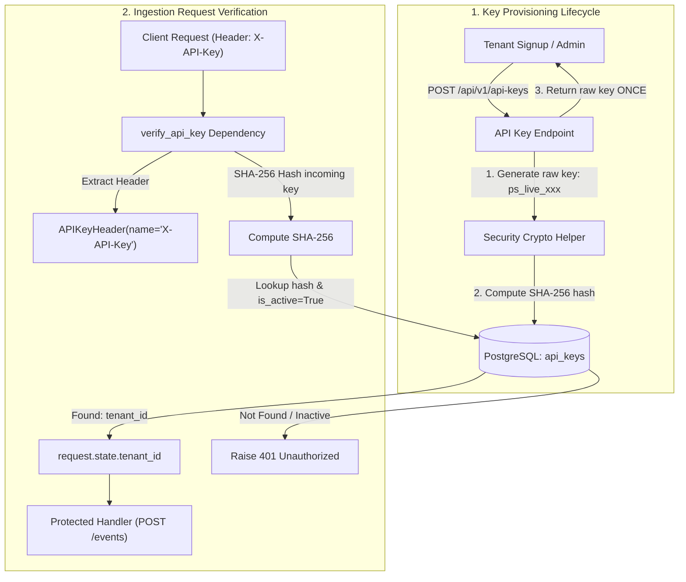

# Task 1.3: API Key Authentication Technical Specification 🔐
### PulseStream: Distributed Security Architecture & Provisioning Scope

---

## 🧭 1. Architectural Motivation & Context

In distributed B2B systems (e.g. Stripe, AWS, GitHub), server-to-server event ingestion requires authentication that satisfies three invariants:
1. **Zero-Friction Ingestion**: Backend microservices must not need complex OAuth refresh token handshakes every 15 minutes. A static, persistent secret key (`X-API-Key: ps_live_...`) is placed in the customer's production `.env`.
2. **Instant Global Revocation**: If a customer developer leaks a key on GitHub, an admin can flip `is_active = FALSE` in PostgreSQL/Redis, immediately revoking access globally.
3. **Implicit Tenant Context**: When an API key is verified, the server extracts `tenant_id` directly from the authenticated key. **Clients do not need to send `tenant_id` in their request bodies**, preventing tenant impersonation.

---

## 📐 2. Architecture & Data Flow Diagram



---

## 📋 3. Detailed Component Specifications

### Component A: Database Model (`api_keys` table)
* **Table Name**: `api_keys`
* **Schema Definition**:
  ```sql
  CREATE TABLE api_keys (
      id VARCHAR(64) PRIMARY KEY,              -- Unique key ID (e.g. "key_01H9X...")
      tenant_id VARCHAR(64) NOT NULL,          -- Identifies the owning tenant ("tenant_acme")
      key_hash VARCHAR(64) NOT NULL UNIQUE,    -- SHA-256 hex digest of raw key (never plaintext!)
      key_prefix VARCHAR(16) NOT NULL,         -- e.g. "ps_live_8f3b..." (for safe UI display)
      name VARCHAR(128) DEFAULT 'Default Key', -- Human-readable identifier
      is_active BOOLEAN NOT NULL DEFAULT TRUE, -- Allows instant revocation
      created_at TIMESTAMP WITH TIME ZONE DEFAULT NOW()
  );

  CREATE INDEX idx_api_keys_hash ON api_keys (key_hash) WHERE is_active = TRUE;
  CREATE INDEX idx_api_keys_tenant ON api_keys (tenant_id);
  ```

---

### Component B: Cryptographic Security Module (`app/services/security.py`)
Responsible for all cryptographic key generation and validation:
1. **Key Generation**:
   * Uses `secrets.token_urlsafe(32)` for cryptographically secure pseudo-random number generation (CSPRNG).
   * Attaches prefix `ps_live_` to distinguish from test keys.
   * Computes one-way `hashlib.sha256(raw_key.encode()).hexdigest()`.
   * Computes safe preview prefix `raw_key[:12] + "..."`.
2. **Key Hashing**:
   * Hashes incoming header strings to match against stored `key_hash`.

---

### Component C: Key Provisioning Endpoint (`POST /api/v1/api-keys`)
* **Route**: `POST /api/v1/api-keys`
* **Request Schema**:
  ```json
  {
    "tenant_id": "tenant_acme",
    "name": "Production Ingest Key"
  }
  ```
* **Response Schema (HTTP 201 Created)**:
  ```json
  {
    "id": "key_01H9XAZ...",
    "tenant_id": "tenant_acme",
    "name": "Production Ingest Key",
    "raw_key": "ps_live_8f3b2a1c9e8d7f6a5b4c3d2e1f0a9b8c",
    "key_prefix": "ps_live_8f3b...",
    "created_at": "2026-09-04T00:00:00Z"
  }
  ```
  > [!IMPORTANT]
  > The `raw_key` is **only returned once** in this creation response. It is never stored in the database.

---

### Component D: FastAPI Authentication Dependency (`app/middleware/auth.py`)
* Uses `APIKeyHeader(name="X-API-Key", auto_error=False)` for OpenAPI integration.
* Checks:
  1. Header present? If missing $\to$ `HTTP 401 Unauthorized` (`Missing X-API-Key header`).
  2. Compute SHA-256 of incoming key.
  3. Query `api_keys` where `key_hash == incoming_hash` and `is_active == True`.
  4. If record not found $\to$ `HTTP 401 Unauthorized` (`Invalid or revoked API Key`).
  5. If valid $\to$ Attach `request.state.tenant_id = record.tenant_id` and return `tenant_id`.

---

### Component E: Route Protection & Payload Decoupling
* **`POST /api/v1/events`**:
  ```python
  @router.post("", response_model=EventResponse, status_code=status.HTTP_201_CREATED)
  async def ingest_event(
      event_in: EventCreate,
      tenant_id: str = Depends(verify_api_key),
      db: AsyncSession = Depends(get_db),
      ...
  ):
      # Event automatically assigned to verified tenant_id
      event_db = EventModel(
          id=event_id,
          tenant_id=tenant_id,  # Set from authenticated key!
          ...
      )
  ```

---

## 🛠️ 4. Execution Step-by-Step Checklist

- [ ] **Step 1**: Add `ApiKeyModel` to `app/models/api_key.py` (or `app/models/event.py`).
- [ ] **Step 2**: Generate and apply Alembic migration for `api_keys` table.
- [ ] **Step 3**: Create cryptographic helper `app/services/security.py`.
- [ ] **Step 4**: Implement `verify_api_key` dependency in `app/middleware/auth.py`.
- [ ] **Step 5**: Implement `POST /api/v1/api-keys` provisioning router in `app/api/v1/api_keys.py`.
- [ ] **Step 6**: Protect `POST /api/v1/events` and `POST /api/v1/webhooks` with `Depends(verify_api_key)`.
- [ ] **Step 7**: Add test script / pytest verifying:
  - Unauthenticated call $\to$ 401.
  - Invalid key $\to$ 401.
  - Revoked key (`is_active=False`) $\to$ 401.
  - Valid key $\to$ 201 Created.
