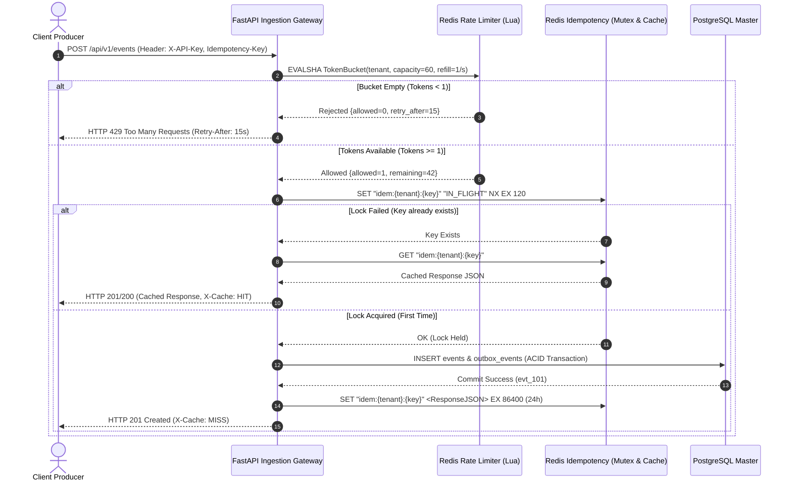

# Sprint 2: Distributed Concurrency & Idempotency Specification ⚡
### PulseStream: Atomic Redis Lua Rate Limiting & 2-Phase Idempotency Lock

---

## 🧭 1. Architectural Motivation & Context

As PulseStream transitions from a single-process development server to a production cluster (multiple Uvicorn workers per container, multiple containers behind an AWS ALB), local memory is no longer a shared source of truth.

Sprint 2 solves two critical distributed computing challenges:

1. **Distributed Rate Limiting (Preventing Noisy Neighbor & DDoS)**:
   - *The Problem*: In-memory rate limiting (`defaultdict(list)`) only tracks requests per worker process. Across 8 workers, a tenant can consume $8\times$ their quota.
   - *The Invariant*: Rate limits must be enforced globally across all cluster nodes with microsecond latency without network round-trip overhead.
   - *The Solution*: **Atomic Redis Lua Token-Bucket Algorithm** executing on an in-memory Redis cluster.

2. **Distributed Idempotency (Preventing Duplicate Side-Effects)**:
   - *The Problem*: When network hiccups cause client timeouts, clients retry `POST /api/v1/events`. If two identical requests arrive concurrently across two workers, a naive database check-then-insert suffers from a **Time-of-Check to Time-of-Use (TOCTOU)** race condition, causing duplicate event ingestion and duplicate customer webhook charges.
   - *The Invariant*: For any given `(tenant_id, Idempotency-Key)`, the event must be processed and persisted **exactly once**, while subsequent requests receive the identical cached response.
   - *The Solution*: **2-Phase Distributed Mutex (`SET NX`) & Response Caching Engine** in Redis.

---

## 📐 2. Architecture & Concurrency Flow



---

## 📋 3. Detailed Component Specifications

---

### Component A: Async Redis Connection Pool (`app/services/redis.py`)

Provides a resilient, non-blocking connection pool for Redis commands:

* **Library**: `redis.asyncio` (installed via `redis>=5.0.3`).
* **Connection Lifecycle**:
  ```python
  from redis.asyncio import ConnectionPool, Redis
  from app.config import settings

  pool = ConnectionPool.from_url(
      settings.REDIS_URL or "redis://localhost:6379/0",
      max_connections=50,
      decode_responses=True
  )

  def get_redis() -> Redis:
      return Redis(connection_pool=pool)
  ```
* **Resilience Invariant**: If Redis is unreachable during rate limiting, PulseStream provides configurable fail-open behavior so a cache outage does not take down the entire ingestion pipeline.

---

### Component B: Atomic Lua Token-Bucket Algorithm (`app/middleware/rate_limiter.py`)

Replaces the in-memory rate limiter with an atomic Redis Lua script executed via `EVALSHA`.

#### 1. The Continuous-Time Token Bucket Formula
Instead of running a background timer to refill tokens every second, tokens are calculated continuously based on elapsed time:
$$\text{Tokens}_{\text{current}} = \min\left(\text{Capacity},\, \text{Tokens}_{\text{last}} + \Delta t \times \text{RefillRate}\right)$$

#### 2. The Atomic Lua Script
```lua
-- KEYS[1]: Rate limit key, e.g. "ratelimit:tenant_acme"
-- ARGV[1]: Capacity (e.g. 60)
-- ARGV[2]: Refill rate per second (e.g. 1.0)
-- ARGV[3]: Current timestamp in seconds (float)
-- ARGV[4]: Cost per request (default 1)

local key = KEYS[1]
local capacity = tonumber(ARGV[1])
local refill_rate = tonumber(ARGV[2])
local now = tonumber(ARGV[3])
local cost = tonumber(ARGV[4])

local data = redis.call("HMGET", key, "tokens", "last_updated")
local tokens = tonumber(data[1])
local last_updated = tonumber(data[2])

if not tokens then
    tokens = capacity
    last_updated = now
else
    local delta = math.max(0, now - last_updated)
    tokens = math.min(capacity, tokens + delta * refill_rate)
    last_updated = now
end

if tokens >= cost then
    tokens = tokens - cost
    redis.call("HMSET", key, "tokens", tokens, "last_updated", last_updated)
    redis.call("EXPIRE", key, math.ceil(capacity / refill_rate) * 2)
    return {1, math.floor(tokens), 0} -- {Allowed=1, Remaining, RetryAfter=0}
else
    local needed = cost - tokens
    local retry_after = math.ceil(needed / refill_rate)
    redis.call("HMSET", key, "tokens", tokens, "last_updated", last_updated)
    return {0, math.floor(tokens), retry_after} -- {Allowed=0, Remaining, RetryAfter}
end
```

#### 3. HTTP Header Standards
Every response must include:
* `X-RateLimit-Limit`: Maximum tenant bucket capacity.
* `X-RateLimit-Remaining`: Remaining token balance.
* `Retry-After`: (On HTTP 429 only) Number of seconds until sufficient tokens refill.

---

### Component C: Distributed Idempotency Filter (`app/middleware/idempotency.py`)

Guarantees at-most-once processing on duplicate client requests.

#### 1. Storage Keys & States
* **Key Format**: `idem:{tenant_id}:{idempotency_key}`
* **State 1: IN_FLIGHT (Mutex Lock)**
  - Value: `"IN_FLIGHT"`
  - Command: `SET key "IN_FLIGHT" NX EX 120`
  - *Purpose*: Prevents concurrent race conditions when identical requests arrive within milliseconds. The 120s TTL prevents deadlocks if a server process terminates unexpectedly.
* **State 2: COMPLETED (Cached Result)**
  - Value: Serialized JSON object:
    ```json
    {
      "status_code": 201,
      "body": {
        "id": "evt_01H9X...",
        "tenant_id": "tenant_acme",
        "event_type": "payment.succeeded",
        "status": "ingested"
      }
    }
    ```
  - TTL: **86,400 seconds (24 Hours)**.

#### 2. Replay Contract
* When an identical `Idempotency-Key` arrives within 24 hours:
  - Gateway bypasses PostgreSQL entirely.
  - Returns the exact cached `status_code` and JSON body.
  - Injects header: `X-Cache: HIT`.

---

## ⚠️ 4. Failure Modes & Edge Cases

| Failure Mode | Risk | Architectural Mitigation |
| :--- | :--- | :--- |
| **Concurrent Duplicate Arrival** | Two requests hit Worker 1 and Worker 2 at the exact same millisecond. | `SET ... NX` returns `OK` only to the first requester. The second request detects the key exists and either awaits the in-flight result or returns a safe conflict. |
| **Worker Process Crash Mid-Flight** | Server crashes after locking Redis but before committing to Postgres. | The lock has a strict 120s TTL (`EX 120`). It expires automatically, allowing subsequent client retries to re-acquire the lock safely. |
| **Redis Outage / Unreachable** | Redis container is down or unreachable. | **Rate Limiting**: Falls open gracefully (logs error, allows request) to preserve availability. **Idempotency**: Falls back to the PostgreSQL database composite unique constraint (`UNIQUE(tenant_id, idempotency_key)`). |
| **Tenant Collision Attack** | Tenant A passes `Idempotency-Key: test_123` and Tenant B passes `test_123`. | Redis key is strictly prefixed with authenticated `tenant_id`: `idem:{tenant_id}:{key}`. Tenant scopes are completely isolated. |

---

## 🧪 5. Test Matrix & Acceptance Criteria

Sprint 2 will be validated by a comprehensive test suite in `projects/pulsestream/tests/test_concurrency.py`:

1. **`test_rate_limiter_permits_under_capacity`**: Verify requests decrement `X-RateLimit-Remaining` accurately.
2. **`test_rate_limiter_rejects_burst_exceeding_capacity`**: Sending $N > \text{Capacity}$ requests returns `HTTP 429` and valid `Retry-After`.
3. **`test_rate_limiter_continuous_refill`**: Sleeping $T$ seconds restores tokens without needing a reset.
4. **`test_idempotency_concurrent_deduplication`**:
   - Send 50 concurrent async requests with the **same** `Idempotency-Key` using `asyncio.gather`.
   - **Assertion**: Exactly 1 request executes the insert (`Exit 201`, `X-Cache: MISS`); 49 requests receive the cached response (`X-Cache: HIT`).
   - **Database Assertion**: `SELECT count(*) FROM events WHERE ...` equals **exactly 1**.
5. **`test_idempotency_tenant_isolation`**: Tenant 1 and Tenant 2 using the same key string do not collide.
