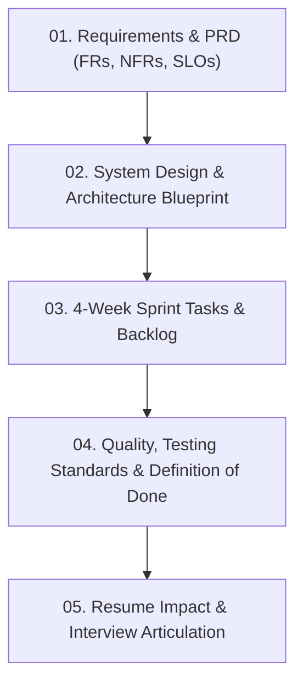

# PulseStream — Product & Engineering Execution Plan 🏛️
### From Requirements Discovery to Production-Grade Architecture & Cloud Release

This planning directory serves as your **Single Source of Truth (SSoT)** for building **PulseStream**. It guides you through the full product lifecycle: requirement gathering, system design, architectural trade-offs, step-by-step sprint tasks, quality expectations, and resume presentation.

---

## 🗺️ Master Planning Roadmap

---

## 📑 Planning Documents Index

| Document | Purpose | Key Content Covered |
| :--- | :--- | :--- |
| [**`01_requirements_and_prd.md`**](./01_requirements_and_prd.md) | **Product Requirements & Scope** | Functional Requirements (FRs), Non-Functional Requirements (NFRs), SLO/SLA targets, User Stories, and Threat Modeling. |
| [**`02_system_design_architecture.md`**](./02_system_design_architecture.md) | **Technical Architecture Blueprint** | Data Flow Diagrams, Transactional Outbox Pattern, Event Lifecycle State Machine, Redis Lua Token Bucket, and HMAC Signing. |
| [**`03_sprint_milestones_and_tasks.md`**](./03_sprint_milestones_and_tasks.md) | **Hands-on Sprint Backlog** | 4-week task checklist with code locations, dependencies, and clear acceptance criteria. |
| [**`04_quality_testing_and_expectations.md`**](./04_quality_testing_and_expectations.md) | **Quality Benchmarks & Expectations** | Definition of Done (DoD), Concurrency Test Scenarios, Locust Load Testing ($1{,}000\text{ req/sec}$), and Resume Bullets. |
| [**`05_api_key_auth_spec.md`**](./05_api_key_auth_spec.md) | **Task 1.3 Auth Specification** | API Key generation, SHA-256 storage, provisioning endpoint, and `verify_api_key` dependency. |
| [**`06_interview_questions_and_scoring.md`**](./06_interview_questions_and_scoring.md) | **Sprint 1 Interview Defense & Scoring Rubric** | Topic-wise interview questions, 1-10 scoring calibration, junior vs senior answers, and core architectural invariants. |
| [**`07_sprint_2_concurrency_and_idempotency_spec.md`**](./07_sprint_2_concurrency_and_idempotency_spec.md) | **Sprint 2 Technical Specification** | Distributed Concurrency, Atomic Redis Lua Token-Bucket Rate Limiter, and 2-Phase Idempotency Mutex Lock. |

---

## 🎯 Primary Engineering Goals
1. **Understand HOW to gather & define requirements** like a Senior Software Engineer.
2. **Master Concurrency & Distributed State** (Redis atomic Lua scripts, idempotency deduplication).
3. **Build Zero-Data-Loss Reliability** (Transactional Outbox pattern, exponential backoff retries, Dead Letter Queue).
4. **Deliver Production Observability & CI/CD** (Prometheus latency metrics, GitHub Actions automation, Docker deployment).
